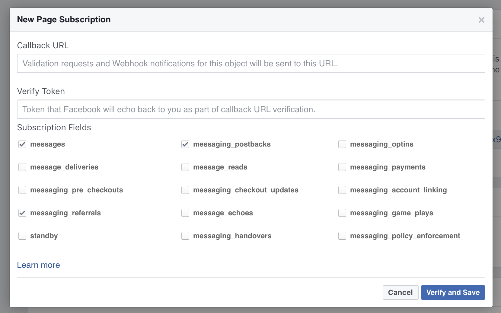

# Stealth Facebook

This integration adds support for Facebook bots within [Stealth](https://github.com/hellostealth/stealth).

[](https://badge.fury.io/rb/stealth-facebook)

## Configure Your Facebook Page

To create your Facebook bot, visit the [Facebook Developers](https://developers.facebook.com) page. Full instructions are provided on the [Facebook Messenger Docs](https://developers.facebook.com/docs/messenger-platform/) page.

When configuring your webhooks, you'll want to enable the `messages`, `messaging_referrals`, and `messaging_postbacks` web hooks like so:



Make sure you don't enable `message_reads` as that is not yet supported by this gem.

## Configure The Integration

```yaml
default: &default
  facebook:
    verify_token: <%= ENV['FACEBOOK_VERIFY_TOKEN'] %>
    page_access_token: <%= ENV['FACEBOOK_ACCESS_TOKEN'] %>
    setup:
      greeting: # Greetings are broken up by locale
        - locale: default
          text: "Welcome to my Facebook Bot."
      get_started:
        payload: new_user
      persistent_menu:
        - locale: default
          composer_input_disabled: false
          call_to_actions:
          - type: payload
            text: Some Button
            payload: some_button

production:
  <<: *default

development:
  facebook:
  verify_token: <%= ENV['FACEBOOK_VERIFY_TOKEN'] %>
  page_access_token: <%= ENV['FACEBOOK_ACCESS_TOKEN'] %>
  setup:
    greeting: # Greetings are broken up by locale
      - locale: default
        text: "Welcome to my Facebook Bot."
    get_started:
      payload: new_user
    persistent_menu:
      - locale: default
        composer_input_disabled: false
        call_to_actions:
        - type: payload
          text: Some Button
          payload: some_button
        - type: nested
          text: Developer
          buttons:
          - type: payload
            text: Restart
            payload: developer_restart

test:
  <<: *default
```

As with all Stealth integrations, integrations can be specified by environment. You'll want to replace `FACEBOOK_VERIFY_TOKEN` and `FACEBOOK_ACCESS_TOKEN` with your respective keys from your Facebook page.

These are the supported setup options:

### greeting
This is the message a user will see via Messenger before they have ever sent your bot a message.

### get_started
When the user presses the `Get Started` button in Messenger, the `payload` specified here is the payload that will be sent to your bot.

### persistent_menu
These are the items that appear in the Facebook Messenger drawer. You can specify menu items for each locale individually or use `default` to make the menu apply to all locales.

The `composer_input_disabled` disables the keyboard input. This is helpful if you anticipate all user replies will come from suggested replies. It defaults to `false` which means the keyboard input is enabled.

The `call_to_actions` list defines the buttons. In the above example, the production environment has a single button defined with the label `Some Button`. It's type is set to `payload`. The `payload` value specifies the payload that will be sent to the bot when the button is pressed.

In the `development` environment, there is a `Developer` sub-menu that contains a single button labeled `Restart`. This just showcases the ability to have sub-menus within the drawer. It's a common practice to introduce a `developer_restart` payload button in development so you can easily restart the bot.

In addition to the `payload` type, the persistent menu supports `url` and `call` type buttons.

### Uploading the Persistent Menu

Each time you make a change to the persistent menu, you will have to upload the change to Facebook. This integration provides a command line task to automate this:

```
stealth setup facebook
```

### Profile Data

By default, your Facebook bots may retrieve the `id`, `name`, `first_name`, `last_name`, and `profile_pic` fields for users that have made this information public and have opted-in to your bot. More info [here](https://developers.facebook.com/docs/messenger-platform/identity/user-profile).

To fetch a user's profile with `stealth-facebook` you can call the following:

```ruby
fb_profile = Stealth::Services::Facebook::Client.fetch_profile(
  recipient_id: current_user_id
)
```

`fb_profile` is a hash that contains the fields above:

```ruby
{
  'id'            => 1464633220279330,
  'name'          => "Carol Robbins",
  'first_name'    => "Carol",
  'last_name'     => "Robbins",
  'profile_pic'   => "https://platform-lookaside.fbsbx.com/platform/profilepic/?psid=1464633220279330&width=1024&ext=1537650777&hash=AeQzWeTgFqlAyiye"
}
```

If your bot has permission to retrieve additional fields, you can specify them as an array of symbols via the `fields` argument:

```ruby
fb_profile = Stealth::Services::Facebook::Client.fetch_profile(
  recipient_id: current_user_id,
  fields: [:id, :name, :first_name, :last_name, :profile_pic, :gender, :locale]
)
```

### Analytics

If you'd like to track custom bot metrics in addition to the ones provided automatically by Facebook Analytics, you can do so starting with version `0.12.0` of this gem.

In order to send these metrics, you'll need to include the `app_id` of the bot as well as the `page_id` of the Facebook page (attached to the bot) to `services.yml`:

```yaml
default: &default
  facebook:
    verify_token: <%= ENV['FACEBOOK_VERIFY_TOKEN'] %>
    page_access_token: <%= ENV['FACEBOOK_ACCESS_TOKEN'] %>
    app_id: <%= ENV['FACEBOOK_APP_ID'] %>
    page_id: <%= ENV['FACEBOOK_PAGE_ID'] %>
    ...
```

Then to collect a metric:

```ruby
Stealth::Services::Facebook::Client.track(recipient_id: u.recipient_id, metric: 'name of your metric', value: 2)
```

You can specify additional options:

```ruby
Stealth::Services::Facebook::Client.track(recipient_id: u.recipient_id, metric: 'signup', value: 2, options: { 'fb_description' => 'A signup occured.' })
```

More info about events, such as which options are available, can be found on [Facebook's Events API docs](https://developers.facebook.com/docs/marketing-api/app-event-api) page.

## Replies

Here are the supported replies for the Facebook integration:

### text

These are standard text replies. It can sent like:

```yaml
- reply_type: text
  text: Hello World!
```

Text replies can also include suggestions, which will be rendered as quick replies:

```yaml
- reply_type: text
  text: What is your favorite color?
  suggestions:
    - text: Blue
    - text: Red
```

Although not as common, text replies can also include buttons:

```yaml
- reply_type: text
  text: Would you like to give us a call?
  buttons:
    - type: call
      phone_number: "+15552991212"
      text: 'Yes'
    - type: payload
      text: 'No'
      payload: 'No'
```

### suggestions

Though suggestions are not a reply type on their own, they are frequently used to optimize the accuracy and speed of your bot. In the `text` reply type above, we used simple labels for our suggestions. Facebook supports a few special types of quick replies, however.

#### Location

You can ask a user for their location:

```yaml
- reply_type: text
  text: "Where are you located?"
  suggestions:
    - type: location
```

If the user chooses to share their location, the `lat` and `lng` will be available via `current_message.location`:

```ruby
current_message.location[:lat]
current_message.location[:lng]
```

#### Email

As of Facebook Messenger Platform 2.3, Facebook now supports a standard way to ask for a user's email:

```yaml
- reply_type: text
  text: "What is your email address?"
  suggestions:
    - type: email
```

The email address the user sends back will be available as the string in `current_message.payload`

#### Phone

As of Facebook Messenger Platform 2.3, Facebook now supports a standard way to ask for a user's phone number:

```yaml
- reply_type: text
  text: "What is your phone number?"
  suggestions:
    - type: phone
```

The phone number the user sends back will be available as the string in `current_message.payload`

#### Images

While images are not a special quick reply type, you can include and `image_url` for a quick reply as way of adding an icon to a quick reply button:

```yaml
- reply_type: text
  text: "What is your favorite color?"
  suggestions:
    - text: Red
      image_url: "http://example.com/img/red.png"
    - text: Blue
      image_url: "http://example.com/img/blue.png"
```

More info [here](https://developers.facebook.com/docs/messenger-platform/send-messages/quick-replies).

### buttons

As with `suggestions`, `buttons` are not a reply type of their own but are used to make your bot more efficient. Facebook supports a few button types and these are the ones currently supported by this integration:

#### payload

This is the most common button type. When a user presses a button that is `payload` type, that payload string will be sent to your bot. For example:

```yaml
- reply_type: text
  text: Please press the button below
  buttons:
    - type: payload
      text: 'Press me!'
      payload: 'button pressed'

```

When a user presses the button labeled "Press me!", the payload `button pressed` will be accessible in bot via `current_message.payload`.

#### url

The `url` button is useful when sharing a link to a website. By default, it will open up within Facebook Messenger.

```yaml
- reply_type: text
  text: Find out more via our website
  buttons:
    - type: url
      text: 'Visit website'
      url: 'https://example.org'

```

You can also specify the height of the webview window that opens up in Messenger via: `webview_height`. You can choose between `compact`, `tall`, and `full`.

More info [here](https://developers.facebook.com/docs/messenger-platform/webview).

#### call

The `call` button type will prompt the user to dial the specified number. The number will be pre-filled in, but the user will still have to confirm by confirming via the modal that is shown. To create a `call` button:

```yaml
- reply_type: text
  text: Give us a ring!
  buttons:
    - type: call
      text: 'Call'
      phone_number: "+15552991212"

```

### Delay

Delays are a very important part of bot design. They introduce a pause between text replies to give the user a chance to read each reply. With this integration, in addition to introducing a delay, we will also send a typing indicator to the user to indicate another reply is forthcoming. To insert a delay in your bot:

```yaml
- reply_type: delay
  duration: 2
```

This will add a `2` second delay (with typing indicator). The `duration` can be specified as any floating point value, in seconds.

### Cards

Facebook distinguishes between a single card and a carousel of cards. This integration does not, however. You can send a single card the same way you would send 10 cards (the current maximum).

```yaml
- reply_type: cards
  sharable: true
  aspect_ratio: horizontal
  elements:
    - title: My App
      subtitle: Download our app below or visit our website for more info.
      image_url: "https://my-app.com/app-image.png"
      buttons:
        - type: url
          url: "https://my-app.com"
          text: 'View'
          webview_height: 'tall'
        - type: url
          url: "https://itunes.apple.com/us/app/my-app"
          text: 'Download iOS App'
```

The above is a single card with two buttons. If you want to include more cards, though, you would just need to specify another listing under the `elements` heading.

The `sharable` and `aspect_ratio` attributes are optional. When `sharable` is set to `true`, a native share button is shown in Messenger for the message. The `aspect_ratio` attribute specifies the aspect ratio of the main card image (specified by `image_url`). It can be set to `horizontal` or `square` with the default being `horizontal`.

More info about Facebook cards [here](https://developers.facebook.com/docs/messenger-platform/send-messages/template/generic).

### List

A Facebook list is useful for displaying things like a news feed. You can find more info about Facebook lists [here](https://developers.facebook.com/docs/messenger-platform/send-messages/template/list).

To generate a list via Stealth Facebook:

```yaml
- reply_type: list
  top_element_style: large
  buttons:
    - type: payload
      text: View More
      payload: view_more
  elements:
    - title: Your Daily News Update
      subtitle: The following stories have been curated just for you.
      image_url: "https://loremflickr.com/320/240"
      buttons:
        - type: url
          url: "https://news-articles.com/199"
          text: 'View'
          webview_height: 'tall'
    - title: Breakthrough in AI
      subtitle: Major breakthrough in the AI space.
      image_url: "https://loremflickr.com/320/320"
      default_action:
        - url: "https://news-articles.com/232"
          webview_height: 'tall'
```

The list itself supports having a single button that will be rendered on the bottom of the list. Each individual list item supports having one button as well. List items should have between 2-4 elements.

In addition to the button, a list item can specify a default action. The default action is what will fired when a user taps the list item. A default action can be specified by setting the `default_action` attribute. The `default_action` should be configured as you would a `url` type button.

The image of the first item in the list is displayed as a cover photo by default. To disable the cover image, set `top_element_style` to `compact`.

### Images

To send an image:

```yaml
- reply_type: image
  image_url: 'https://example.org/image.png'
```

The `image_url` should be set to URL where the image has been uploaded.

Image replies support buttons and suggestions like text replies.

### Files

To send a file:

```yaml
- reply_type: file
  file_url: 'https://example.org/some.pdf'
```

The `file_url` should be set to URL where the file has been uploaded.

File replies support buttons and suggestions like text replies.

### Video

To send a video:

```yaml
- reply_type: video
  video_url: 'https://example.org/cool_video.mp4'
```

The `video_url` should be set to URL where the video has been uploaded.

Video replies support buttons and suggestions like text replies.

### Audio

To send an audio clip:

```yaml
- reply_type: audio
  audio_url: 'https://example.org/podcast.mp3'
```

The `audio_url` should be set to URL where the video has been uploaded.

Audio replies support buttons and suggestions like text replies.
